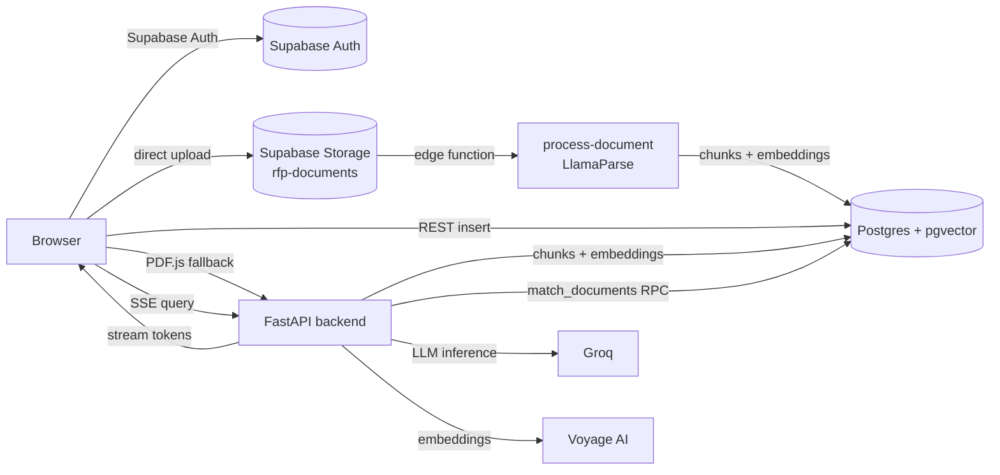

# Architecture

RFPANDA is a Retrieval-Augmented Generation (RAG) app for asking questions
against your own documents. It is intentionally built to run entirely on free
tiers (Vercel Hobby, Render Free, Supabase Free, Groq Free, Voyage AI Free),
which drives several of the design decisions below.

## System overview

### Components

| Layer | Tech | Responsibility |
|-------|------|----------------|
| Frontend | Next.js 14 (App Router), Tailwind | Auth, upload, document library, streaming chat UI |
| Backend | FastAPI, Python 3.12 | Auth verification, query embeddings, pgvector search, Groq SSE streaming |
| Database | Supabase Postgres + `pgvector` | Documents, chunks, 1024-d embeddings, vector search RPCs, RLS |
| Storage | Supabase Storage | Private `rfp-documents` bucket (`{user_id}/{document_id}/{filename}`) |
| Ingestion | Supabase Edge Functions (Deno) | LlamaParse extraction → chunking → Voyage embeddings → insert |
| LLM | Groq (`llama-3.3-70b-versatile`) | Grounded answer generation |
| Embeddings | Voyage AI (`voyage-3`, 1024-d) | Document + query vectors |

## Ingestion pipeline

1. **Upload (client → storage).** The browser uploads the file straight to
   Supabase Storage, bypassing serverless body limits. A `documents` row is
   inserted first with `status = 'uploaded'`.
2. **Primary parse.** The client invokes the `process-document` edge function,
   which calls LlamaParse and stores page-aware Markdown.
3. **Chunking.** `_shared/chunker.ts` produces table-preserving, section-aware
   chunks (roughly 500–1000 tokens with overlap).
4. **Embedding + persist.** Chunks are embedded with Voyage AI in batches and
   inserted into `document_chunks`; the document is marked `processed`.

### Fallback path

Free LlamaParse tiers hit rate limits. When that happens the edge function
marks the document `awaiting_fallback_parse` and the UI offers **Run fallback**:

1. The browser downloads the file from storage and extracts text with PDF.js.
2. It POSTs `{ document_id, pages }` to `POST /api/documents/fallback-parse`.
3. The backend chunks the text and runs embedding/persist as a background task,
   flipping the status to `fallback_processing` → `processed`.

## Query pipeline

1. Client `POST /api/query` with a Bearer token and the question.
2. Backend verifies the token (HS256 if `SUPABASE_JWT_SECRET` is set, otherwise
   Supabase `/auth/v1/user`), then embeds the query with Voyage AI.
3. `match_documents` RPC runs a cosine-similarity search over
   `document_chunks`, scoped by `filter_user_id` and optional
   `filter_document_ids`.
4. Retrieved chunks are sent to Groq as context; the answer is streamed back
   over SSE (`metadata`, `token`, `done` events) and rendered with inline
   `[[Doc: file, p. X]]` citations.
5. After a successful answer, `touch_document_last_queried` updates document
   activity timestamps used by the cleanup job.

## Data model

| Table | Purpose |
|-------|---------|
| `documents` | One row per uploaded file: owner, status, size, `keep_forever`, metadata |
| `document_chunks` | Chunk text + `vector(1024)` embedding + page/section metadata |
| `user_usage` | Per-user query/document counters enforcing free-tier limits |
| `cleanup_audit_logs` | Audit trail for the nightly stale-document cleanup |

### Key RPCs

- `match_documents(query_embedding, match_threshold, match_count, filter_user_id, filter_document_ids)` — vector search.
- `touch_document_last_queried(p_document_ids uuid[])` — activity tracking.
- `cleanup_stale_documents(retention_interval)` — deletes documents untouched for
  30 days unless `keep_forever` is set (scheduled with `pg_cron`).
- `increment_query_count`, `increment_document_count`, `decrement_document_count` — usage limits.

## Security

- **Row Level Security** on `documents` and `document_chunks` isolates tenants.
- Storage policies restrict object access to the owner's `{user_id}/...` prefix.
- The backend never trusts client-supplied user IDs — it derives the user from
  the verified JWT and passes it to every query.
- The `service_role` key is used only server-side / inside edge functions.

## Free-tier engineering

- **Memory:** the backend holds no model weights. Baseline RSS is ~90–120 MB,
  well under Render's 512 MB cap; `/health` and `/api/system/metrics` expose
  live RSS and assert it stays below a 300 MB target.
- **Serverless limits:** uploads go directly to storage and LLM responses use
  SSE direct-to-backend, avoiding Vercel's 4.5 MB body and 10 s execution limits.
- **Cold starts:** `.github/workflows/keepalive.yml` pings `/health` every
  10 minutes so the free Render instance stays warm (see `docs/DEPLOYMENT.md`).
